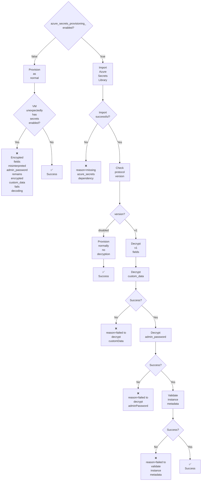

```mermaid
flowchart TD
    A{azure_secrets_provisioning_<br/>enabled?} -->|false| B[Provision<br/>as<br/>normal]
    B --> C{VM<br/>unexpectedly<br/>has<br/>secrets<br/>enabled?}
    C -->|Yes| D[❌<br/>Encrypted<br/>fields<br/>misinterpreted<br/>admin_password<br/>remains<br/>encrypted<br/>custom_data<br/>fails<br/>decoding]
    C -->|No| H[✅<br/>Success]

    A -->|true| I[Import<br/>Azure<br/>Secrets<br/>Library]
    I --> J{Import<br/>successful?}
    J -->|No| K[❌<br/>reason=missing<br/>azure_secrets<br/>dependency]
    J -->|Yes| L[Check<br/>protocol<br/>version]
    L --> M{version?}
    M -->|disabled| N[Provision<br/>normally<br/>no<br/>decryption]
    N --> Z[✅<br/>Success]
    M -->|v1| O[Decrypt<br/>v1<br/>fields]
    O --> P[Decrypt<br/>custom_data]
    P --> Q{Success?}
    Q -->|No| R[❌<br/>reason=failed to<br/>decrypt<br/>customData]
    Q -->|Yes| T[Decrypt<br/>admin_password]

    T --> U{Success?}
    U -->|No| V[❌<br/>reason=failed to<br/>decrypt<br/>adminPassword]
    U -->|Yes| W[Validate<br/>instance<br/>metadata]
    W --> Y{Success?}
    Y -->|No| AA[❌<br/>reason=failed to<br/>validate<br/>instance<br/>metadata]
    Y --> |Yes| END[✅<br/>Success]

```