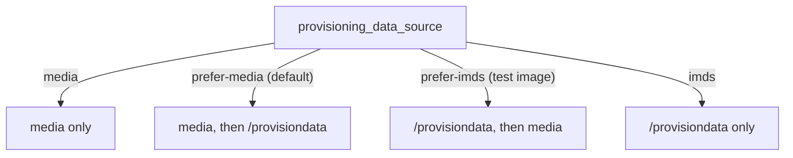
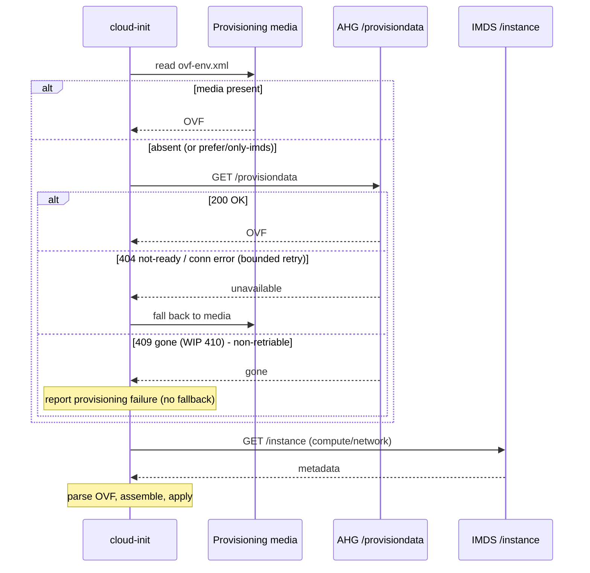

# cloud-init Azure `/provisiondata` provisioning source — spec

**Scope:** cloud-init (guest) changes only. The host/control-plane contract is
owned by the AHG/AMP "Linux Provisioning Endpoint" design (A. Mao, Draft
2026-06-16). This document captures what cloud-init must do, the delta from the
current implementation, and the milestone/PR breakdown.

**Status:** Draft / WIP. Endpoint URL and error codes below are **provisional**
in code and must be reconciled with the AHG contract (see M2).

## 1. Summary

Today cloud-init reads `ovf-env.xml` for source (initial) and non-PPS instances
from **provisioning media** (mounted ISO/UDF). The AHG design adds a
service-backed endpoint that returns the same OVF XML, letting cloud-init obtain
provisioning inputs without media. cloud-init parses the OVF, performs final
assembly, and still queries `169.254.169.254/instance` for compute/network
metadata independently.

PPS **reuse** continues to use the existing `/reprovisiondata` endpoint and is
out of scope here.

### 1.1 Flow (cloud-init)

> Diagrams use `graph`/`sequenceDiagram` (not `flowchart`) and quoted labels so
> they render in Azure DevOps wiki, which reports *"Unsupported diagram type"*
> for the `flowchart` keyword.

Source selection (`provisioning_data_source`):

Acquisition + fallback (default `prefer-media`):

## 2. Current vs. target (cloud-init)

| Aspect | Current | Target |
|---|---|---|
| Initial OVF source | provisioning media only | media and/or `/provisiondata` |
| Selection | n/a | `provisioning_data_source` config |
| Endpoint (WIP) | `169.254.169.254/metadata/provisiondata?api-version=2019-06-01` | AHG: `168.63.129.16/provisiondata` (no `/metadata`, no `api-version`) |
| "Gone" code | `410` (WIP) | `409` (AHG) |
| Instance/network metadata | IMDS `/instance` | unchanged |

## 3. Config / transition model (cloud-init-owned)

`datasource.Azure.provisioning_data_source`:

| Value | Behavior |
|---|---|
| `media` | media only (legacy) |
| `imds` | `/provisiondata` only |
| `prefer-media` | media first, `/provisiondata` fallback |
| `prefer-imds` | `/provisiondata` first, media fallback |

- **Upstream default: `prefer-media`.** Media-backed VMs never call the endpoint,
  so the unsupported-host `404` (Section 4) has no boot impact.
- **`prefer-imds` is opt-in** (test image via `cloud.cfg.d`) while the endpoint
  rolls out.
- Invalid values warn and fall back to the built-in default (never fatal).

## 4. Retry / error semantics

The endpoint is polled with bounded retry. Networking must be up first.

| HTTP | AHG meaning | cloud-init action (target) | Current WIP |
|---|---|---|---|
| 200 | success | parse OVF, use it | same |
| 403 | rate limited (no `Retry-After`) | retry | **not retried** (retries `429`) |
| 404 | not ready yet | retry (bounded) | retried ✓ |
| 409 | retired / deleted | **non-retriable → report failure** | uses `410` for this |
| 410 | goal state not ready | retry | **treated as gone/non-retriable** |
| 500 | unhandled failure | retry (TBD: cap?) | retried |
| 503 | CS overloaded | retry | retried ✓ |
| 504 | upstream timeout | retry | retried ✓ |

Additional cloud-init behavior:

- **Unsupported host returns `404` today and this cannot change now**, so `404`
  is retried until a bounded deadline (WIP: **120 s**; AHG doc cites ~5 min).
  Mitigated by the `prefer-media` default. A future distinct "unsupported"
  signal (or readiness bound ~60 s) would remove this latency.
- Non-transient codes (e.g. `501`) are **not** retried → prompt fallback.
- Connection errors are capped (`max_connection_errors`) → prompt fallback when
  IMDS/WireServer is unreachable (e.g. Azure Stack).
- On the non-retriable "gone" code, cloud-init reports a provisioning failure
  and does **not** fall back to media (window was missed). Reason string:
  `http error <code> querying IMDS provisiondata`.
- Malformed / non-Azure response → treated as unusable, fall back (never bricks).
- Response body is **not logged** (`log_req_resp=False`); OVF carries secrets.

## 5. What needs to change (WIP → AHG contract)

Tracked in **M2** below:

1. Endpoint URL → `168.63.129.16/provisiondata`; drop `/metadata` prefix and
   `api-version`. Confirm required request headers (ContainerId is resolved by
   AHG from source IP; guest sends none).
2. "Gone / non-retriable" code `410` → **`409`**; make `410` retriable
   (goal-state-not-ready).
3. Rate-limit code `429` → **`403`** (retry without `Retry-After`).
4. Decide retry/cap for `500`; drop `502` if AHG never emits it.
5. Update `ReportableError` reason/telemetry strings accordingly.
6. Confirm retry window (align 120 s vs ~5 min) and any readiness bound.

## 6. Milestones → PRs (cloud-init)

- **M1 — Transition scaffolding (this PR, WIP):**
  `provisioning_data_source` config (default `prefer-media`);
  `imds.fetch_provision_data()`; `_load_ovf_from_media()` refactor;
  `_fetch_provisiondata_ovf()` + `crawl_metadata` wiring; retry/error handling;
  config validation; parse-fallback; connection cap; unit tests. Endpoint URL and
  error codes are provisional placeholders.
- **M2 — Contract reconciliation (after AHG endpoint is live):**
  apply Section 5 deltas; update tests to the final URL/codes/headers.
- **M3 — Enablement / E2E:**
  test-image `cloud.cfg.d` sets `prefer-imds` (tuxops); Overlake E2E; Cirrus;
  staged rollout ring + success metrics.
- **M4 — PPS reuse alignment (future):**
  define `/reprovisiondata` lifecycle when `/provisiondata` is the initial
  source (staging/retirement, guest-visible codes during the reuse window).
- **M5 — Future (out of MVP):**
  fail-fast readiness signal; confidential-VM encrypted blob; provisioning
  health (`POST /provisioning/health`); consolidated JSON payload (Option 3).

## 7. Open questions (cloud-init-relevant)

- Final endpoint host/path: WireServer `168.63.129.16` vs IMDS `169.254.169.254`?
- Request headers required by AHG for `/provisiondata`?
- `500` retriable, and final retry window / readiness bound?
- PPS reuse mapping to a new `/reprovisiondata` lifecycle.

## 8. Reference

AHG/AMP "Linux Provisioning Endpoint — Design" (A. Mao) and the cloud-init
[provisioning-protocol proposal](https://msazure.visualstudio.com/One/_git/Compute-AzLinux-Cloudinit?path=%2Finternal-docs%2Fenghub%2Fproposals%2Fprovisioning-protocol.md&version=GBcpatterson%2Fproposal-protocol&_a=preview).
